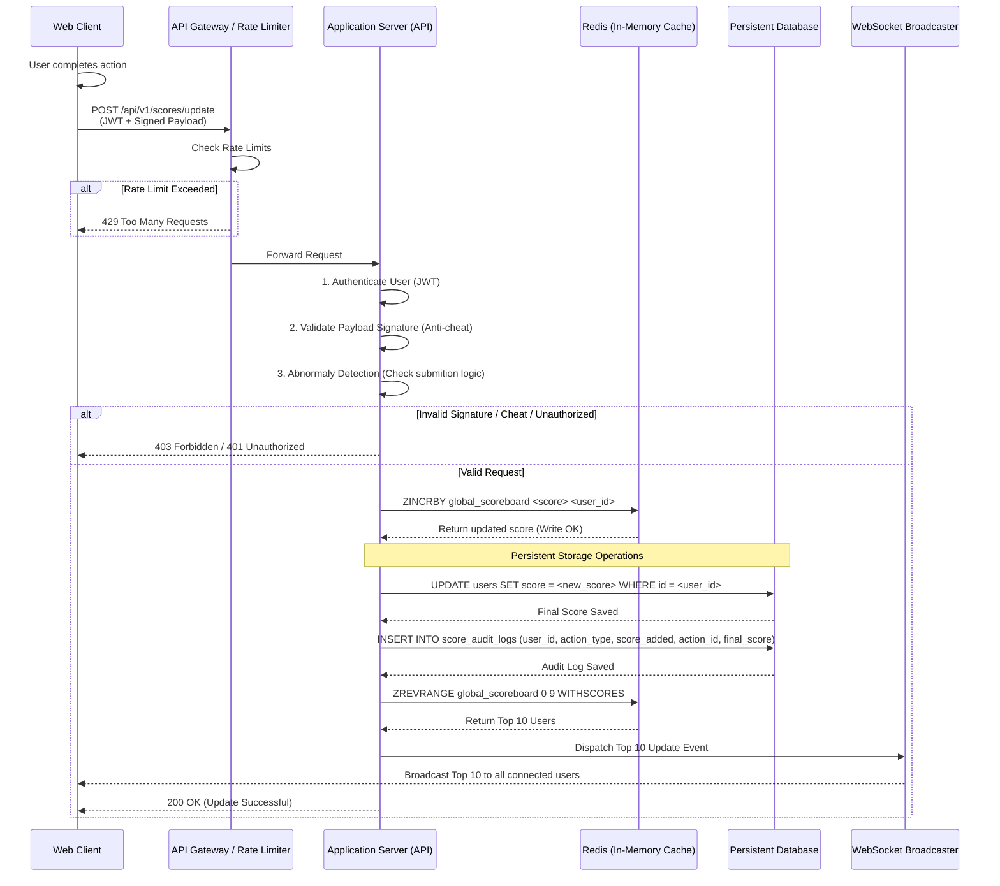
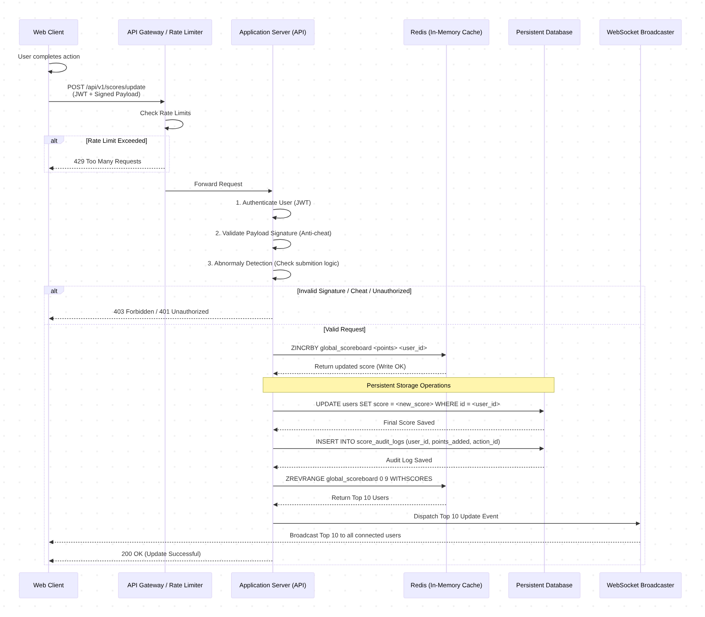

# Live Scoreboard API Module Specification
## 1. Overview

This is application architecture design for a backend that handles the real-time processing, storage, and broadcasting of user scores for the top 10 scoreboard.

Main goals:
 - secure API endpoint for user to submit action 
 - updates the internal ranking
 - and pushes live updates to connected web clients
 - secure against malicious users

## 2. Architecture & Flow of Execution

The following sequence diagram illustrates the lifecycle of a score update:



Image preview: 


## 3. Core Requirements & Technical Stack

- Primary Database: PostgreSQL (for persistent audit trails and user data).
- In-Memory Store: Redis (Utilizing Sorted Sets for highly optimized, $O(\log N)$ scoreboard ranking).
- Real-time Protocol: WebSockets or Server-Sent Events (SSE).

## 4. API Specification

### 4.1. Submit Score 

- UpdateEndpoint: POST /api/v1/scores/update
- Headers:Authorization: Bearer <JWT_TOKEN>
- Body (JSON):

```
{
  "action_id": "uuid-v4",
  "timestamp": 1712543247,
  "action_type: "finish_game",
  "signature": "a7d8e9f...[HMAC-SHA256 signature]..."
}
```

### 4.2. WebSocket Connection 

- Endpoint: wss://<apihost>/ws/scoreboard
- Behavior: Clients connect to this namespace upon loading the website. The server broadcasts a TOP_10_UPDATE event whenever the leaderboard changes.

## 5. Security & Anti-Cheat Mechanisms
To prevent malicious users from arbitrarily increasing their scores, we must implement these security checks:

### 5.1. JWT Authentication: 
All requests must include a valid JWT for authentication, validate api request comes from valid user.

### 5.2. Payload Signature (Make sure user's submitted data comes from correct clients): 
- The client must sign the request payload (action_id + action_type + timestamp) using a cryptographic hash (e.g., HMAC-SHA256) with a secret key embedded (and obfuscated) in the client app. 
- The server verifies this signature to ensure the request originated from the legitimate client application, not Postman or a script.

### 5.3. Replay Attack Prevention: 
The server must validate the timestamp (rejecting requests older than ~30 seconds) and cache the action_id in Redis to ensure the same action cannot be submitted twice.

### 5.4. Strict Rate Limiting & Anomaly Detection:
Limit requests to some amount of actions per minute per user at the API Gateway level. Additional logic may need to cap user submission rate to lower than 10 actions under 1 minutes (base on real application logic).


## 6. Improvement Notes

### 6.1. Server-Side Action Validation: 
Currently we only check for rate limiting of user's submissions.
Improvement: Base on business logic, validate the sequence of action logs on the server to check for malicious attempt.

### 6.2. Debouncing WebSocket Broadcasts: 
If thousands of users are scoring simultaneously, broadcasting every single update will flood the WebSocket server. 
Improvement: Implement a throttle/debounce mechanism on the server side to only broadcast the Top 10 state a maximum of once every 1 or 2 seconds.

### 6.3. Redis Fallback: 
We should handle the case of Redis failure, write score on database and read from database. This will result if degraded performance but will keep application running and won't lost user's score.

### 6.4. Write behind Cache:
Now we are writing to the database after redis write, this will be a bottle neck if the application scale up to millions of user. We can push DB update to a message queue and background workers to reduce write pressure.